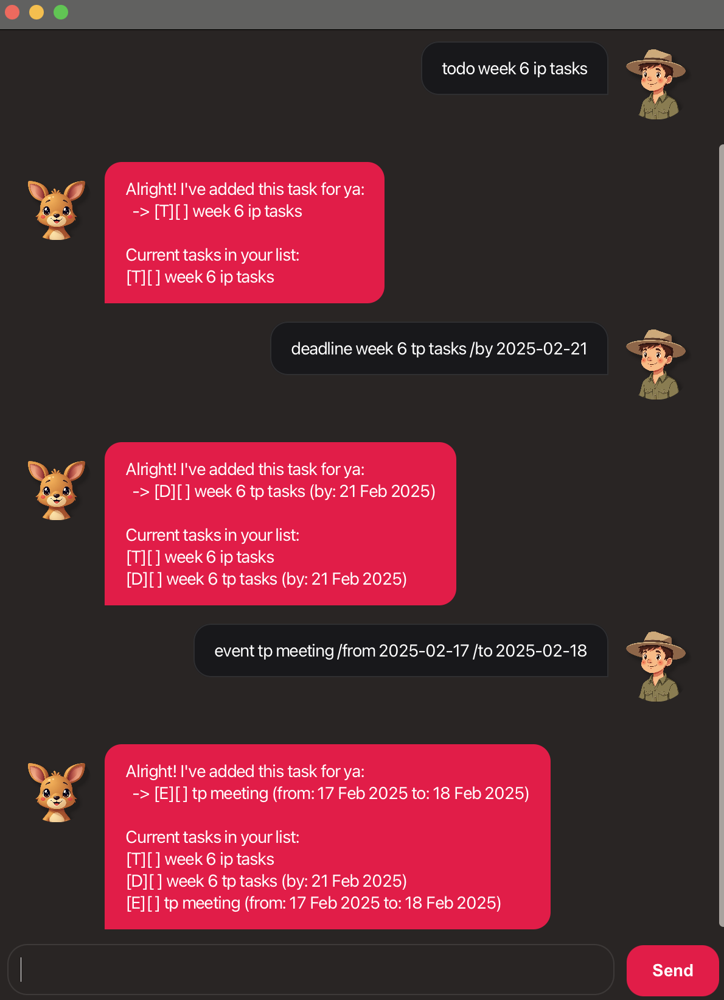

# Joey User Guide

Joey is a desktop task management application for those who prefer to work with a Command Line Interface (CLI) while still having the benefits of a Graphical User Interface (GUI). If you can type fast, Joey can help you manage your tasks faster than traditional GUI apps.



## Adding a Todo Task

Add a simple task without any dates to your task list.

Format: `todo DESCRIPTION`

Example: `todo read book`

```
Alright! I've added this task for ya:
-> [T][] read book

Current tasks in your list:
[T][] read book
```

## Adding a Deadline

Add a task with a due date to your task list.

Format: `deadline DESCRIPTION /by DATE`

Example: `deadline complete assignment /by 2024-02-20`

```
Alright! I've added this task for ya:
-> [D][] complete assignment (by: 20 Feb 2024)

Current tasks in your list:
[T][] read book
[D][] complete assignment (by: 20 Feb 2024)
```

## Adding an Event

Add a task with start and end dates to your task list.

Format: `event DESCRIPTION /from START_DATE /to END_DATE`

Example: `event team meeting /from 2024-02-20 /to 2024-02-21`

```
Alright! I've added this task for ya:
-> [E][] team meeting (from: 20 Feb 2024 to: 21Feb 2024)

Current tasks in your list:
[T][] read book
[D][] complete assignment (by: 20 Feb 2024)
[E][] team meeting (from: 20 Feb 2024 to: 21Feb 2024)
```

## Listing Tasks

Display all tasks in your task list.

Format: `list`

```
Here are the tasks in your list:
1. [T][] read book
2. [D][] complete assignment (by: 20 Feb 2024)
3. [E][] team meeting (from: 20 Feb 2024 to: 21 Feb 2024)
```

## Marking Tasks as Done/Undone

Mark or unmark a task as complete.

Format:
- `mark INDEX`
- `unmark INDEX`

Example: `mark 1`

```
Marked task number 1!:
-> [T][✘] read book
Awesome job completing it! 🎉
```

## Deleting Tasks

Remove a task from your task list.

Format: `delete INDEX`

Example: `delete 1`

```
Poof! Task Removed! 💨:
-> [T][✘] read book

Updated task list:
[D][] complete assignment (by: 20 Feb 2024)
[E][] team meeting (from: 20 Feb 2024 to: 21Feb 2024)
```

## Finding Tasks

Find tasks containing specific keywords.

Format: `find KEYWORD`

Example: `find meeting`

```
Ta-da! ✨ Here are the tasks matching your search:
1. [E][✘] team meeting (from: 20 Feb 2024 to: 21 Feb 2024)
```

## Exiting the Program

Save all tasks and exit Joey.

Format: `bye`

Example: `bye`